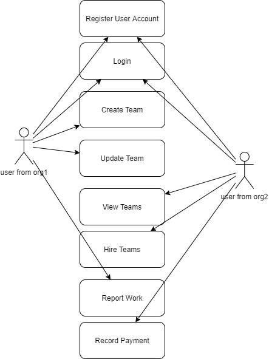
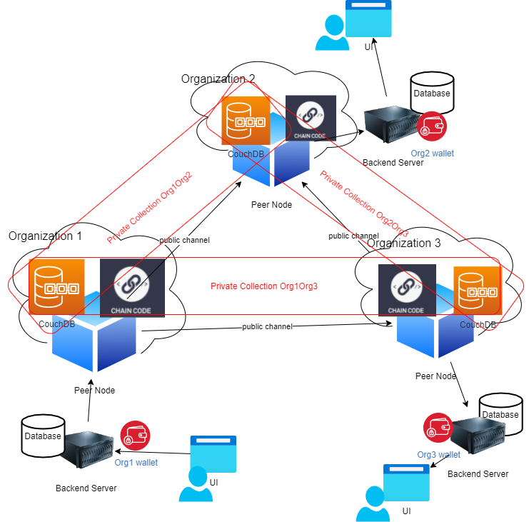
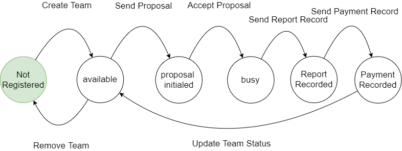

# B-partner
This is a decentrolised platform based on [HYPERLEDGER FABRIC](https://www.hyperledger.org/use/fabric) allowing companies to share their employees.

## USE CASE

Every jonined orgnization can register their vacant teams to this platform and hire other orgnization's available teams. One of the purposes of this is to accumulate trusts.

I use Hyperledger Fabric in this project because it is a decentralized system and provides audibility. We can post the team information on the public channel, and also upload some kind of sensitive info and disclosure agreement to the private storage just between the involved parties. The digital signature and the block make sure it will never be changed.

Hopefully this project can be the opportunity for parter companies to share more their resources, and break the data isolation.

## ARCHITECTURE

Currently it is still a MVP, only the chaincode part done, and the backend allowing to access to the blokchian diretly, but it should be improved with the features: uploading file, user notification, proposal search, etc. 

The Frontend is to be developed.

## FSM

## Instruction
1. Install the hyperledger fabric. [Tutorial](https://hyperledger-fabric.readthedocs.io/en/release-2.2/getting_started.html). I have copied most used scripts to ./myscript.sh
2. Run the admin scripts to register admin and generate user wallets.
3. Move the wallets to backend to replace the testing wallets and install the libraries.
4. Install a mongodb and config the url in backend/index.js.
5. Create the fisrt admin user for the api. However, I did not provide and endpoint to register admin. So you can use my code in backend/test.js to generate the username and password, and then manually insert to the mongodb, and change its role to admin, or you could create extre endpoints. 
6. Install latest postman and import my json endpoint records.
7. Sign in with admin and reuse the JWT from response for rest operations.